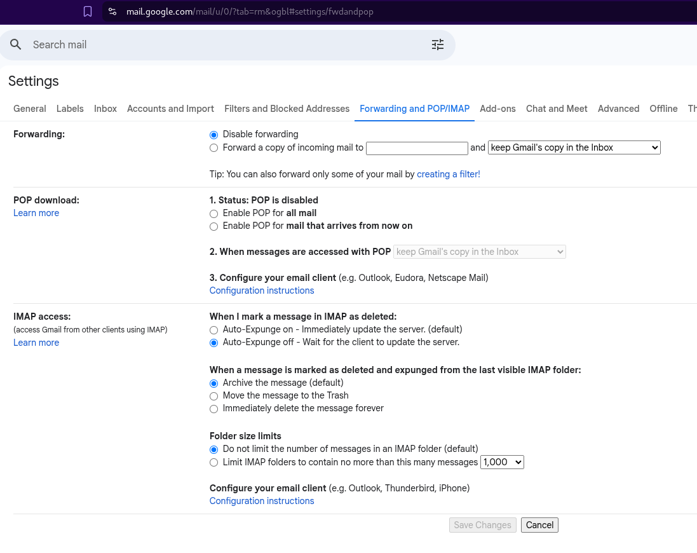

# Linux Kernel Contribution Tutorial

## 시작하기 전에

이번 Linux Kernel Contribution Tutorial을 진행하기 위해서는 호스트 환경에 리눅스 OS가 설치되어 있어야 합니다. 아래의 튜토리얼은 데비안 계열의 리눅스 배포판에서 실습을 진행합니다.

즉, 이번 과정에서는 호스트가 리눅스인 환경 내에서 KVM 리눅스 가상화 환경을 사용합니다. 만약에 현재 리눅스 환경이 준비가 되어 있지 않다면, 리눅스를 랩탑이나 집에 남는 컴퓨터에 설치하거나 (아래 링크에서 iso 이미지 다운로드, rufus 로 부팅 디스크를 만들고 기존 OS 와 듀얼 부트 하던지 설치하여) 라즈베리파이와 같은 SBC 를 구하여 진행하는 것을 권장합니다.

설치 이미지 다운로드 링크
- 데비안: https://www.debian.org/distrib/index.ko.html
- 우분투: https://ubuntu.com/download/desktop

### FAQ 

- Q. 저는 리눅스 환경을 보통 가상화해서 사용합니다. 이런 환경을 사용해보면 안 되나요? 즉, 윈도우에서 WSL2을 활용하고 윈도우나  맥에서 virtualbox, vmware descktop /fusion 또는 UTM 으로 가상화해서 이번 실습을 진행하면 안될까요?
- A. 다른 OS의 가상머신에서 이번 실습을 진행한다면, 이어서 진행하는 KVM 가상화 환경를 사용할 수 있는 환경인 virt-me 툴을 사용하는데 어려움이 있습니다. 따라서 앞서 언급한대로 리눅스를 듀얼 부팅이나 별도의 머신에 설치해서 진행하는 것을 권장합니다. 그리고 호스트 리눅스 환경을 설치하면 여러분의 머신에서 바로 여러분이 컴파일한 리눅스 커널을 직접 돌려볼 수 있습니다. 

## virtme-ng 튜토리얼

튜토리얼에 필요한 패키지들을 설치합니다.

```
# 커널 빌드에 필요한 패키지
$ sudo apt install -y build-essential flex bison bc pahole libelf-dev libssl-dev kmod libncurses-dev

# virtme-ng 가상머신 환경 구축용 패키지
$ sudo apt install -y git python3-pip python3-venv qemu-system

# Plain Text 이메일 전송용 패키지
$ sudo apt install -y git-email
```

커널 소스 다운로드
```
$ git clone -b staging-testing git://git.kernel.org/pub/scm/linux/kernel/git/gregkh/staging.git
```

파이썬 venv 환경을 만들어줍니다.
```
$ python3 -m venv venv-virtme
$ source venv-virtme/bin/activate
$ pip3 install git+https://github.com/arighi/virtme-ng.git
```

# 커널을 빌드하고 vng 를 이용해서 가상머신으로 실행해보기
```
$ cd staging

$ vng --build
$ vng --verbose
```

환경이 제대로 구축되었는지 확인하기 위해 간단한 테스트를 해볼께요!

`init/main.c` 파일의 kernel_init() 함수에서 `rcu_end_inkernel_boot();` 바로 이후에 아래의 출력 코드를 추가해보세요:
```
# v6.18 기준으로 보면 여기 위치에 있습니다.
# https://github.com/torvalds/linux/blob/v6.18/init/main.c#L1504
pr_err("\n\n -- Happy New Year Linux Contributor -- \n\n");
```

`vng --build` 로 다시 빌드하고 `vng --verbose` 실행한 후에 쉘로 접속하면, ` dmesg | grep Contributor`  를 실행하여 여러분이 추가한 출력 문구를 확인해보세요!

---

## 컨트리뷰션 체크 포인트 (1) 기존 코드 스타일 체크

우선 코드 스타일 체크를 진행해볼까요? 이렇게 해서 첫번째 컨트리뷰션을 할 부분을 찾아볼 수 있습니다.

checkpatch.pl 스크립트를 수행하기 전에, 필요한 파이썬 패키지를 venv 환경에서 설치해줍니다. 
```
$ pip3 install ply gitpython
```

아래 스크립트를 실행하면 코드 스타일을 보완할 부분을 찾을 수 있어요.
```
# tools/testing/selftests/ 하위의 모든 C 코드 파일에 대해서 스타일 체크함
$ scripts/checkpatch.pl tools/testing/selftests/**/*.c
```

출력된 결과에서 Error 로 어떤 부분들이 나오는 지 확인해보세요.

## Git 설정

Gmail 을 기준으로 컨트리뷰션을 하기 위한 `.gitconfig` 설정을 진행해볼께요.
```
$ git config --global user.email "My Name is here ..."
$ git config --global user.name "My@Email.is here ..."

$ git config sendemail.smtpServer smtp.gmail.com
$ git config sendemail.smtpEncryption tls
$ git config sendemail.smtpServerPort 587
$ git config sendemail.smtpUser "My@Email.is here ..."

# https://myaccount.google.com/apppasswords
$ git config sendemail.smtpPass <APP PASSWORD>
```
또는 다음과 같이 직접 파일을 수정하여 진행해도 되요. `vim ~/.gitconfig`
```
[user]
        name = My Name is ...
        email = My@Email.is ...

[sendemail]
        confirm = auto
        smtpServer = smtp.gmail.com
        smtpServerPort = 587
        smtpEncryption = tls
        smtpUser = My@Email.is here ...
        smtpPass = My App Password is here ...
```

## Plain Text 메일 전송 테스트 해보기

위의 설정이 끝나고 난 다음에 테스트 메일이 잘 가는지 확인해봅시다. 
```
$ echo "Subject: Hello" > hello.txt

$ git send-email --to="My@Email.is here ... " --cc="My@Email.is here ... " \
	--confirm=always hello.txt
```

## Git send mail based contribution guide

이제 다음 과정은 Git 을 사용해서 패치를 만드는 일반적인 과정을 진행합니다.
```
# Make topical branch
$ git checkout -b <작업할 브랜치 이름>

# 작업 후 패치에 추가할 파일들 확인하기
$ git status -vv

$ git add tools/testing/......<작업한 파일들>
```

항상 잊지 말고, 커널 코딩 스타일 준수하며 커밋하기:
- https://github.com/torvalds/linux/blob/master/Documentation/process/coding-style.rst
- https://docs.kernel.org/process/coding-style.html
```
# Commit 과 사이닝 실행
$ git commit -s 
```

첨부할 패치파일을 만듭니다.
```
# 1개의 커밋이면
$ git format-patch -1

# 여러 개의 커밋이면
$ git format-patch <commit_hash>..HEAD

$ scripts/checkpatch.pl <patch file(s)>
```

Gmail 의 IMAP 설정을 조정해줘야 하는 부분이 있습니다.


Plain text로 패치를 포함한 이메일을 보내는 과정입니다.
```
$ scripts/get_maintainer.pl $FIXED_FILE # to, cc 할 메일 확인

$ git send-email --to="TestTo@Email.is here ... " --cc="TestCc@Email.is here ... " \
	--confirm=always MyPatchFile.patch
```

TODO: 시리즈 패치에 커버레터 추가 관련 내용 추가 필요함.

---

## b4 based contribution guide

- https://b4.docs.kernel.org/
- https://b4.docs.kernel.org/en/latest/contributor/prep.html

**싱글 패치(1개)**와 **시리즈 패치(2개 이상)**의 워크플로우를 비교해 드리겠습니다.

가장 큰 차이점은 **"커버 레터 작성 유무"**와 **"커밋 메시지의 역할"**입니다. 요청하신 `git commit -s` 단계를 포함하여 순서대로 비교합니다.

### 1. 싱글 패치 (Single Patch)

- 특징: 이메일 1통만 전송함.
- 핵심: 커밋 메시지 본문이 곧 이메일의 본문이 되므로, 커밋 메시지를 잘 써야 합니다.

#### 단계별 진행

1. 브랜치 생성 (b4)

```
# Make topical branch
$ b4 prep -n fix-testing-bug -f v6.12
```

2. 작업 및 커밋 (git)

- 코드를 수정합니다.
- `git commit -s` 실행해서 커밋하기. `-s` 옵션 필수** (Signed-off-by 자동 추가).
  - 이때 항상 잊지 말고, 커널 코딩 스타일 준수: https://github.com/torvalds/linux/blob/master/Documentation/process/coding-style.rst
  - https://docs.kernel.org/process/coding-style.html 
- checkpatch 실행: `./scripts/checkpatch.pl --file <your_file.c>`

```
git add .
git commit -s -m "subsys: fix potential deadlock in timer"
# (엔터 후 상세 내용 작성: 왜 고쳤는지, 어떤 문제였는지 상세히 기술)

```

> **주의:** 여기서 작성한 내용이 메일링 리스트에 그대로 나갑니다.

3. **수신자 자동 지정**
```bash
b4 prep --auto-to-cc

```

4. **커버 레터 작성? (NO!)**
* **이 단계는 건너뜁니다.** (`b4 prep --edit-cover` 실행 금지)
* 패치가 1개일 때는 커버 레터가 불필요합니다.


5. **검증 및 전송**
```bash
b4 prep --check             # 스타일 체크
b4 send --reflect           # [PATCH] ... 1통만 뜨는지 확인
b4 send

```

### 2. 시리즈 패치 (Patch Series)

* **특징:** 이메일 N+1통 전송됨 (커버 레터 1통 + 패치 N통).
* **핵심:** 각 패치의 디테일은 각 커밋 메시지에 적고, 전체 시리즈의 **"개요와 목적"**은 커버 레터에 적습니다.

#### 단계별 진행

1. **브랜치 생성 (b4)**
```bash
b4 prep -n feature-net-driver -f v6.12

```


2. **작업 및 커밋 (git) - 여러 개**
* 논리적으로 단위를 쪼개서 여러 번 커밋합니다.


```bash
# 첫 번째 패치
git add file1.c
git commit -s -m "net: add basic driver structure"

# 두 번째 패치
git add file2.c
git commit -s -m "net: implement transmit function"

```


3. **수신자 자동 지정**
```bash
b4 prep --auto-to-cc

```


4. **커버 레터 작성 (YES!)**
* 시리즈는 "이 묶음이 무엇인지" 설명하는 표지가 필요합니다.


```
b4 prep --edit-cover

```


* 에디터가 열리면 **제목(Subject)**과 **본문(Blurb)**을 작성합니다.
* 예: "이 시리즈는 새로운 XX 네트워크 드라이버를 추가하고 관련 API를 개선합니다."


5. **검증 및 전송**
```bash
b4 prep --check
b4 send --reflect           # [PATCH 0/N] 커버레터 + [PATCH 1/N]... 뜨는지 확인
b4 send

```


---

### 🛠️ 한눈에 비교하기

| 구분 | 싱글 패치 (1개) | 시리즈 패치 (2개 이상) |
| --- | --- | --- |
| **Git Commit** | `git commit -s` 1회 | `git commit -s` 여러 회 |
| **b4 prep --edit-cover** | **실행하지 않음** (X) | **반드시 실행함** (O) |
| **이메일 구성** | `[PATCH] 제목` (총 1통) | `[PATCH 0/N]` (커버) + `[PATCH 1/N]`... |
| **설명 위치** | 커밋 메시지 본문 | 전체 요약(커버레터) + 각 패치 상세(커밋) |
| **v2 변경로그 위치** | `---` 구분선 아래 (주석 영역) | 커버 레터 하단 |

### 💡 팁: 실수로 커버 레터를 만들었다면?

싱글 패치인데 실수로 `b4 prep --edit-cover`를 해서 내용을 적어버렸다면, `b4 send` 할 때 0/1, 1/1 두 통이 나갈 수 있습니다. 이럴 땐:

1. `b4 prep --edit-cover`를 다시 실행합니다.
2. 내용을 **모두 지우고** 저장합니다. (빈 파일로 저장)
3. `b4`가 커버 레터가 비어있음을 감지하고 싱글 패치 모드로 돌아갑니다.

---

## kselftest를 돌려보면서 컨트리뷰션 가이드 복습 및 Linux Kernel Testing 살펴보기

이 가이드는 `tools/testing` 디렉토리에 처음 기여하려는 분들을 위한 튜토리얼입니다.

## 목차
1. [시작하기 전에](#시작하기-전에)
2. [디렉토리 구조](#디렉토리-구조)
3. [첫 번째 테스트 작성하기](#첫-번째-테스트-작성하기)
4. [테스트 빌드 및 실행](#테스트-빌드-및-실행)
5. [패치 제출하기](#패치-제출하기)

---

### 시작하기 전에

### 코딩 스타일
- 커널 코딩 스타일 준수: `Documentation/process/coding-style.rst`
- checkpatch 실행: `./scripts/checkpatch.pl --file <your_file.c>`

---

### 디렉토리 구조

| 디렉토리 | 설명 |
|---------|------|
| `selftests/` | 유저스페이스 셀프테스트 (가장 활발) |
| `kunit/` | 커널 유닛 테스트 프레임워크 |
| `ktest/` | 커널 테스트 자동화 스크립트 |

### selftests 하위 구조
```
selftests/
├── <subsystem>/     # 서브시스템별 테스트
│   ├── Makefile     # 빌드 규칙
│   ├── config       # 필요한 커널 설정
│   └── *.c          # 테스트 소스
├── kselftest.h      # 공통 헤더
└── lib.mk           # 공통 Makefile 규칙
```

---

## 첫 번째 테스트 작성하기

### 1. 기본 테스트 템플릿

```c
// selftests/<subsystem>/my_test.c
#include "../kselftest.h"

int main(void)
{
    ksft_print_header();
    ksft_set_plan(1);  // 테스트 개수

    if (/* 테스트 조건 */)
        ksft_test_result_pass("테스트 통과\n");
    else
        ksft_test_result_fail("테스트 실패\n");

    ksft_finished();
}
```

### 2. Makefile 수정

기존 서브시스템에 추가:
```makefile
# selftests/<subsystem>/Makefile
TEST_GEN_PROGS += my_test
```

새 서브시스템 생성:
```makefile
# selftests/my_subsystem/Makefile
TEST_GEN_PROGS := my_test
include ../lib.mk
```

### 3. 상위 Makefile 등록 (새 서브시스템인 경우)

```makefile
# selftests/Makefile
TARGETS += my_subsystem
```

---

## 테스트 빌드 및 실행

### 단일 테스트
```
cd tools/testing/selftests/<subsystem>
make
./my_test
```

### 서브시스템 전체
```
make -C tools/testing/selftests TARGETS=<subsystem> run_tests
```

### 전체 테스트
```
make kselftest
```

기존에 작성되어 있는 테스트를 동작시켜보고, 실패하는 케이스를 분석하고 수정하는 과정도 좋은 컨트리뷰션 항목입니다.

---

## 패치 제출하기

### 1. 커밋 메시지 형식
```
selftests/<subsystem>: 간단한 설명

상세 설명 (필요시)

Signed-off-by: 이름 <email@example.com>
```

### 2. 패치 생성
```
git format-patch -1
```

### 3. 메인테이너 확인
```
./scripts/get_maintainer.pl tools/testing/selftests/<subsystem>/
```

### 4. 패치 전송
```
git send-email --to=<maintainer> --cc="script/get_maintainer.pl 에서 추천해준 메일링 리스트들" *.patch
```

kselftest는 커널 설정뿐만 아니라 사용자 공간(userspace) 도구가 필요하지만, 커널 내부 기능 테스트를 위해서는 관련 디버그 설정을 켜야 합니다.

추천 설정:

- `CONFIG_RUNTIME_TESTING_MENU=y`: 이 메뉴 아래에 수많은 셀프 테스트 옵션이 들어있습니다.

현재 # CONFIG_..._SELFTEST is not set으로 되어 있는 부분 중, 본인이 확인하려는 서브시스템(예: CONFIG_GLOB_SELFTEST, CONFIG_LOCK_TORTURE_TEST 등)을 y나 m으로 변경하세요.
```
# 필요한 부분이 있다면 make menuconfig 에서 / 로 아래 설정을 찾고 켜보세요.
$ grep SELFTEST .config
# CONFIG_KALLSYMS_SELFTEST is not set
# CONFIG_STATIC_KEYS_SELFTEST is not set
# CONFIG_STATIC_CALL_SELFTEST is not set
CONFIG_NET_SELFTESTS=y
# CONFIG_DMABUF_SELFTESTS is not set
# CONFIG_FIPS_SIGNATURE_SELFTEST is not set
# CONFIG_RANDOM32_SELFTEST is not set
# CONFIG_GLOB_SELFTEST is not set
# CONFIG_DEBUG_LOCKING_API_SELFTESTS is not set
# CONFIG_WW_MUTEX_SELFTEST is not set
# CONFIG_X86_DECODER_SELFTEST is not set
# CONFIG_DEBUG_NMI_SELFTEST is not set
# CONFIG_ATOMIC64_SELFTEST is not set
```

커널 설정이 변경되었다면, 다시 빌드해주고 머신에 들어가서 확인해줍니다.
```
$ vng --build
$ vng --verbose

# 부팅 이후에
$ cd staging

$ cd tools/testing/selftests/<subsystem>
$ make
$ ./my_test
```

---

## 유용한 리소스

- [Kselftest Wiki](https://kselftest.wiki.kernel.org/)
- `Documentation/dev-tools/kselftest.rst`
- `Documentation/dev-tools/kunit/`

## 도움 받기

- 메일링 리스트: linux-kselftest@vger.kernel.org
- IRC: #kernelnewbies on OFTC

---

1. 시작하기 전에 - 필수 도구 설치, 코딩 스타일 체크 방법
2. 디렉토리 구조 - selftests, kunit, ktest 등 주요 디렉토리 설명
3. 첫 번째 테스트 작성하기 - kselftest.h 사용한 기본 템플릿, Makefile 수정법
4. 테스트 빌드 및 실행 - 단일/서브시스템/전체 테스트 실행 명령어
5. 패치 제출하기 - 커밋 메시지 형식, get_maintainer.pl 사용법, git send-email 방법


## Kunit을 활성화하면 커널을 동작시켜보고 컨트리뷰션할 부분을 찾아보기

KUnit을 사용하려면 먼저 프레임워크 자체를 활성화해야 합니다. 단순히 `CONFIG_KUNIT=y`만 하는 것보다, 테스트 결과를 보기 좋게 출력하기 위해 아래 옵션들을 `make menuconfig`에서 설정할 수 있습니다.

필수 설정:
- `CONFIG_KUNIT=y`: KUnit 프레임워크 활성화

권장 설정:
- `CONFIG_KUNIT_ALL_TESTS=m` (또는 y): 대부분의 커널 내 KUnit 테스트를 한 번에 활성화합니다.
- `CONFIG_KUNIT_DEBUGFS=y`: /sys/kernel/debug/kunit을 통해 테스트 결과를 확인할 수 있게 해줍니다.

또는 스크립트로 다음과 같이 설정 자동화할 수 있습니다.
```
# KUnit 활성화
scripts/config --enable CONFIG_KUNIT
# 예시: 예제 테스트 활성화
scripts/config --enable CONFIG_KUNIT_EXAMPLE_TEST
```

```
$ find linux -name "*.kunitconfig"

$ find linux -name "*_test.c" -path "*/lib/*"

$ find linux -name "*_kunit.c" -o -name "*-kunit.c" -o -name "*_test.c" 2>/dev/null | grep -v selftests | wc -l (using tool: shell)
Purpose: 전체 kunit 테스트 파일 개수
187
```

```
$ find linux -name "*_kunit.c" -o -name "*-kunit.c" -o -name "*_test.c" 2>/dev/null | grep -v selftests | sed 's|linux/||' | cut -d'/' -f1-2 | sort | uniq -c | sort -rn | head -30 (using tool: shell)
Purpose: 서브시스템별 kunit 테스트 분포

     46 drivers/gpu
     25 lib/tests
     15 tools/testing
     12 lib/crypto
      6 lib/math
      4 tools/virtio
      4 drivers/net
      4 drivers/clk
      3 kernel/trace
      3 drivers/comedi
      2 net/mptcp
      2 net/core
      2 lib/kunit
      2 fs/tests
      2 drivers/soc
      2 drivers/scsi
      2 drivers/platform
      2 drivers/of
      1 tools/spi
      1 tools/mm
      1 sound/soc
      1 sound/hda
      1 sound/core
      1 security/apparmor
      1 samples/watch_queue
      1 samples/connector
      1 net/sunrpc
      1 net/hsr
      1 mm/rodata_test.c
      1 mm/kmsan
```

KUnit 테스트는 각 서브시스템 소스 디렉토리 내에 분산되어 있어요. 주요 위치:

| 위치 | 테스트 수 | 설명 |
|------|----------|------|
| drivers/gpu/ | 46 | DRM/GPU 드라이버 테스트 |
| lib/tests/ | 25 | 커널 라이브러리 함수 테스트 |
| lib/crypto/tests/ | 12 | 암호화 라이브러리 테스트 |
| lib/math/ | 6 | 수학 함수 테스트 |
| drivers/clk/ | 4 | 클럭 드라이버 테스트 |
| kernel/trace/ | 3 | 트레이싱 테스트 |
| fs/tests/ | 2 | 파일시스템 테스트 |

.kunitconfig 파일이 있는 주요 서브시스템:
- fs/ext4/, fs/fat/, fs/unicode/
- mm/damon/, mm/kfence/
- drivers/input/, drivers/hid/, drivers/gpu/drm/
- net/sunrpc/, net/handshake/
- security/landlock/

KUnit 테스트 실행:
```
# 특정 서브시스템
./tools/testing/kunit/kunit.py run --kunitconfig=lib/kunit

# 전체
./tools/testing/kunit/kunit.py run
```

- https://docs.kernel.org/dev-tools/kunit/index.html
- https://docs.kernel.org/dev-tools/kunit/run_wrapper.html
- https://kunit.dev/

----

먼저 우리가 살펴볼 부분은 tools/testing 디렉토리 구조와 기존에 작성된 문서가 있습니다.

기존 문서와 CONTRIBUTING 가이드를 살펴볼까요?

Searching for files: **/Documentation/dev-tools/testing* (using tool: glob)Searching for files: **/CONTRIBUTING* (using tool: glob)Reading file: linux/Documentation/dev-tools/kselftest.rst, from line 1 to 100 (using tool: read)
 ✓ linux/Documentation/dev-tools/kselftest.rst

```
$ find linux -name "*.kunitconfig" 2>/dev/null | head -30 (using tool: shell)
Purpose: kunitconfig 파일 위치 찾기

$ find linux -name "*_test.c" -path "*/lib/*" 2>/dev/null | head -20 (using tool: shell)
Purpose: lib 디렉토리의 kunit 테스트 파일 찾기

linux/fs/fat/.kunitconfig
linux/fs/ext4/.kunitconfig
linux/fs/unicode/tests/.kunitconfig
linux/fs/hfsplus/.kunitconfig
linux/fs/hfs/.kunitconfig
linux/net/handshake/.kunitconfig
linux/net/sunrpc/.kunitconfig
linux/mm/kfence/.kunitconfig
linux/mm/damon/tests/.kunitconfig
linux/drivers/clk/.kunitconfig
linux/drivers/input/tests/.kunitconfig
linux/drivers/of/.kunitconfig
linux/drivers/leds/.kunitconfig
linux/drivers/iommu/generic_pt/.kunitconfig
linux/drivers/fpga/tests/.kunitconfig
linux/drivers/hid/.kunitconfig
linux/drivers/android/tests/.kunitconfig
linux/drivers/base/test/.kunitconfig
linux/drivers/firewire/.kunitconfig
linux/drivers/gpu/drm/vc4/tests/.kunitconfig
linux/drivers/gpu/drm/tests/.kunitconfig
linux/drivers/gpu/drm/xe/.kunitconfig
linux/drivers/gpu/drm/ttm/tests/.kunitconfig
linux/drivers/gpu/drm/vkms/tests/.kunitconfig
linux/drivers/gpu/drm/scheduler/.kunitconfig
linux/rust/.kunitconfig
linux/lib/kunit/.kunitconfig
linux/sound/core/.kunitconfig
linux/security/landlock/.kunitconfig
linux/init/.kunitconfig

linux/lib/percpu_test.c
linux/lib/rbtree_test.c
linux/lib/tests/hashtable_test.c
linux/lib/kunit/executor_test.c
linux/lib/kunit/assert_test.c
linux/lib/packing_test.c
linux/lib/atomic64_test.c
linux/lib/interval_tree_test.c
linux/lib/xz/xz_dec_test.c
```

```
$ find linux -name "*_kunit.c" -o -name "*-kunit.c" 2>/dev/null | head -40 (using tool: shell)

linux/fs/tests/exec_kunit.c
linux/fs/tests/binfmt_elf_kunit.c
linux/fs/unicode/tests/utf8_kunit.c
linux/drivers/platform/x86/intel/pmt/discovery-kunit.c
linux/drivers/net/ethernet/microchip/vcap/vcap_api_debugfs_kunit.c
linux/drivers/net/ethernet/microchip/vcap/vcap_api_kunit.c
linux/drivers/net/ethernet/microchip/vcap/vcap_model_kunit.c
linux/drivers/android/tests/binder_alloc_kunit.c
linux/drivers/base/regmap/regmap-kunit.c
linux/drivers/char/misc_minor_kunit.c
linux/drivers/gpu/drm/xe/tests/xe_gt_sriov_pf_config_kunit.c
linux/drivers/gpu/drm/xe/tests/xe_guc_buf_kunit.c
linux/drivers/gpu/drm/xe/tests/xe_sriov_pf_service_kunit.c
linux/lib/crc/tests/crc_kunit.c
linux/lib/crypto/tests/polyval_kunit.c
linux/lib/crypto/tests/poly1305_kunit.c
linux/lib/crypto/tests/sha1_kunit.c
linux/lib/crypto/tests/curve25519_kunit.c
linux/lib/crypto/tests/sha384_kunit.c
linux/lib/crypto/tests/sha256_kunit.c
linux/lib/crypto/tests/sha512_kunit.c
linux/lib/crypto/tests/sha224_kunit.c
linux/lib/crypto/tests/blake2b_kunit.c
linux/lib/crypto/tests/sha3_kunit.c
linux/lib/crypto/tests/md5_kunit.c
linux/lib/crypto/tests/blake2s_kunit.c
linux/lib/tests/stackinit_kunit.c
linux/lib/tests/bitfield_kunit.c
linux/lib/tests/memcpy_kunit.c
linux/lib/tests/cpumask_kunit.c
linux/lib/tests/printf_kunit.c
linux/lib/tests/ffs_kunit.c
linux/lib/tests/util_macros_kunit.c
linux/lib/tests/fortify_kunit.c
linux/lib/tests/overflow_kunit.c
linux/lib/tests/base64_kunit.c
linux/lib/tests/string_kunit.c
linux/lib/tests/siphash_kunit.c
linux/lib/tests/checksum_kunit.c
linux/lib/tests/scanf_kunit.c
```

```
$ find linux -name "*_kunit.c" -o -name "*-kunit.c" -o -name "*_test.c" 2>/dev/null | grep -v selftests | wc -l (using tool: shell)
Purpose: 전체 kunit 테스트 파일 개수

187
```

```
$ find linux -name "*_kunit.c" -o -name "*-kunit.c" -o -name "*_test.c" 2>/dev/null | grep -v selftests | sed 's|linux/||' | cut -d'/' -f1-2 | sort | uniq -c | sort -rn | head -30 (using tool: shell)
Purpose: 서브시스템별 kunit 테스트 분포

     46 drivers/gpu
     25 lib/tests
     15 tools/testing
     12 lib/crypto
      6 lib/math
      4 tools/virtio
      4 drivers/net
      4 drivers/clk
      3 kernel/trace
      3 drivers/comedi
      2 net/mptcp
      2 net/core
      2 lib/kunit
      2 fs/tests
      2 drivers/soc
      2 drivers/scsi
      2 drivers/platform
      2 drivers/of
      1 tools/spi
      1 tools/mm
      1 sound/soc
      1 sound/hda
      1 sound/core
      1 security/apparmor
      1 samples/watch_queue
      1 samples/connector
      1 net/sunrpc
      1 net/hsr
      1 mm/rodata_test.c
      1 mm/kmsan
```

KUnit 테스트는 각 서브시스템 소스 디렉토리 내에 분산되어 있어요. 주요 위치:

| 위치 | 테스트 수 | 설명 |
|------|----------|------|
| drivers/gpu/ | 46 | DRM/GPU 드라이버 테스트 |
| lib/tests/ | 25 | 커널 라이브러리 함수 테스트 |
| lib/crypto/tests/ | 12 | 암호화 라이브러리 테스트 |
| lib/math/ | 6 | 수학 함수 테스트 |
| drivers/clk/ | 4 | 클럭 드라이버 테스트 |
| kernel/trace/ | 3 | 트레이싱 테스트 |
| fs/tests/ | 2 | 파일시스템 테스트 |

.kunitconfig 파일이 있는 주요 서브시스템:
- fs/ext4/, fs/fat/, fs/unicode/
- mm/damon/, mm/kfence/
- drivers/input/, drivers/hid/, drivers/gpu/drm/
- net/sunrpc/, net/handshake/
- security/landlock/

KUnit 테스트 실행:
```
# 특정 서브시스템
./tools/testing/kunit/kunit.py run --kunitconfig=lib/kunit

# 전체
./tools/testing/kunit/kunit.py run
```

## KUnit 동작 방식 (memcpy_kunit.c 예제)

### 1. 테스트 구조 정의

```c
// memcpy_kunit.c 하단
static struct kunit_case memcpy_test_cases[] = {
    KUNIT_CASE(memset_test),           // 일반 테스트
    KUNIT_CASE(memcpy_test),
    KUNIT_CASE_SLOW(memcpy_large_test), // 느린 테스트 (타임아웃 3배)
    KUNIT_CASE_SLOW(memmove_test),
    {}  // 종료 마커
};

static struct kunit_suite memcpy_test_suite = {
    .name = "memcpy",
    .test_cases = memcpy_test_cases,
};

kunit_test_suite(memcpy_test_suite);  // 등록 매크로
```

### 2. 등록 매크로 내부 동작

```c
// include/kunit/test.h
#define kunit_test_suite(suite) kunit_test_suites(&suite)

#define kunit_test_suites(__suites...)                          \
    __kunit_test_suites(__UNIQUE_ID(array), ##__suites)

#define __kunit_test_suites(unique_array, ...)                  \
    static struct kunit_suite *unique_array[]                   \
    __used __section(".kunit_test_suites") = { __VA_ARGS__ }
```

→ .kunit_test_suites ELF 섹션에 suite 포인터 배열 저장

### 3. 테스트 실행 흐름

```
부팅/모듈 로드
    ↓
kunit_run_tests(suite)           // lib/kunit/test.c
    ↓
kunit_suite_for_each_test_case() // 각 테스트 케이스 순회
    ↓
kunit_run_case_catch_errors()    // try-catch로 감싸서 실행
    ↓
kunit_try_run_case()
    ├── suite->init(test)        // 초기화 (있으면)
    ├── test_case->run_case(test) // 실제 테스트 함수 실행
    └── suite->exit(test)        // 정리 (있으면)
```

### 4. Assertion 매크로 동작

```c
// memcpy_kunit.c에서 사용
KUNIT_ASSERT_EQ_MSG(test, instance.data[i], v, "메시지...");
```

```c
// include/kunit/test.h
#define KUNIT_ASSERT_EQ_MSG(test, left, right, fmt, ...)        \
    KUNIT_BINARY_INT_ASSERTION(test, KUNIT_ASSERTION,           \
                               left, ==, right, fmt, ...)

#define KUNIT_BINARY_INT_ASSERTION(...)                         \
    KUNIT_BASE_BINARY_ASSERTION(...)

#define KUNIT_BASE_BINARY_ASSERTION(test, ..., left, op, right, ...) \
do {                                                            \
    const typeof(left) __left = (left);                         \
    const typeof(right) __right = (right);                      \
    if (likely(__left op __right))                              \
        break;  /* 성공: 아무것도 안함 */                        \
    _KUNIT_FAILED(test, ...);  /* 실패 처리 */                  \
} while (0)
```

### 5. 실패 시 동작

KUNIT_ASSERTION (ASSERT) vs KUNIT_EXPECTATION (EXPECT)
- ASSERT 실패 → __kunit_abort() → 테스트 즉시 중단
- EXPECT 실패 → 실패 기록 후 계속 진행


```c
// lib/kunit/test.c
void __noreturn __kunit_abort(struct kunit *test)
{
    kunit_try_catch_throw(&test->try_catch);  // longjmp로 탈출
}
```

### 6. 출력 형식 (TAP/KTAP)

KTAP version 1
# Subtest: memcpy
1..6
    ok 1 - memset_test
    ok 2 - memcpy_test
    ok 3 - memcpy_large_test
    ok 4 - memmove_test
    ok 5 - memmove_large_test
    ok 6 - memmove_overlap_test
ok 1 - memcpy


### 7. 핵심 구조체 관계
```
kunit_suite (테스트 스위트)
    ├── name: "memcpy"
    ├── init/exit: 각 테스트 전후 실행
    └── test_cases[] → kunit_case (개별 테스트)
                           ├── name: "memcpy_test"
                           ├── run_case: memcpy_test 함수 포인터
                           └── attr.speed: SLOW 등

kunit (실행 컨텍스트)
    ├── status: SUCCESS/FAILURE/SKIPPED
    ├── try_catch: 예외 처리용
    └── resources: 자동 정리 리소스 목록
```

## kselftest

- https://docs.kernel.org/dev-tools/kselftest.html

```
$ ls -1 linux/tools/testing/selftests/ | head -60 (using tool: shell)
Purpose: selftests 서브시스템 목록 확인

Makefile
acct
alsa
amd-pstate
arm64
bpf
breakpoints
cachestat
capabilities
cgroup
clone3
connector
core
coredump
cpu-hotplug
cpufreq
damon
devices
dmabuf-heaps
drivers
dt
efivarfs
exec
fchmodat2
filelock
filesystems
firmware
fpu
ftrace
futex
gen_kselftest_tar.sh
gpio
hid
ia64
intel_pstate
iommu
ipc
ir
kcmp
kexec
kho
kmod
kselftest
kselftest.h
kselftest_deps.sh
kselftest_harness
kselftest_harness.h
kselftest_install.sh
kselftest_module.h
kvm
landlock
lib
lib.mk
livepatch
liveupdate
lkdtm
locking
lsm
media_tests
membarrier
```

```
$ ls -1 linux/tools/testing/selftests/ | wc -l && ls -1 linux/tools/testing/selftests/ | tail -60 (using tool: shell)
Purpose: selftests 전체 개수와 나머지 목록

130

namespaces
nci
net
nolibc
ntb
openat2
pci_endpoint
pcie_bwctrl
perf_events
pid_namespace
pidfd
power_supply
powerpc
prctl
proc
pstore
ptp
ptrace
rcutorture
resctrl
ring-buffer
⠋riscv
 rlimits
Thinking...rseq
rtc
run_kselftest.sh
rust
safesetid
sched
sched_ext
seccomp
sgx
signal
size
sparc64
splice
static_keys
sync
syscall_user_dispatch
sysctl
tc-testing
tdx
thermal
timens
timers
tmpfs
tpm2
tty
turbostat
ublk
uevent
user_events
vDSO
verification
vfio
vsock
watchdog
wireguard
x86
zram
```

kselftest는 tools/testing/selftests/ 디렉토리에 서브시스템별로 분리되어 있습니다.

총 130개 디렉토리/파일이 있고, 주요 서브시스템:

| 카테고리 | 서브시스템 |
|---------|-----------|
| 아키텍처 | x86, arm64, riscv, powerpc, sparc64, ia64 |
| 메모리 | mm, membarrier, kho, zram |
| 네트워크 | net, tc-testing, vsock, wireguard |
| 파일시스템 | filesystems, fuse, tmpfs, proc |
| 프로세스 | pidfd, pid_namespace, clone3, exec, futex |
| 스케줄러 | sched, sched_ext, cpu-hotplug, cpufreq |
| 보안 | landlock, seccomp, lsm, capabilities, sgx |
| 드라이버 | drivers, gpio, hid, alsa, kvm |
| BPF | bpf |
| 트레이싱 | ftrace, perf_events, ring-buffer |
| 시간 | timers, rtc, timens |
| 기타 | cgroup, namespaces, ipc, signal, ptrace |

각 서브시스템 구조:
selftests/<subsystem>/
├── Makefile          # 빌드 규칙
├── config            # 필요한 커널 CONFIG 옵션
├── *.c / *.sh        # 테스트 소스
└── .gitignore

```
# 특정 서브시스템
make -C tools/testing/selftests TARGETS=net run_tests

# 전체
make kselftest

selftest.c 또는 selftest_*.c 또는 lib/*selftest*.c 등은 kselftest 와 관련있는 테스트들:

$ find linux -name "*selftest*.c" 2>/dev/null | grep -v tools/testing/selftests | head -40 (using tool: shell)
Purpose: selftests 디렉토리 외부의 selftest 관련 파일 찾기

linux/net/bluetooth/selftest.c
linux/net/core/selftests.c
linux/arch/x86/platform/intel-quark/imr_selftest.c
linux/arch/x86/kernel/nmi_selftest.c
linux/arch/xtensa/kernel/s32c1i_selftest.c
linux/crypto/asymmetric_keys/selftest_rsa.c
linux/crypto/asymmetric_keys/selftest_ecdsa.c
linux/crypto/asymmetric_keys/selftest.c
linux/crypto/krb5/selftest_data.c
linux/crypto/krb5/selftest.c
linux/drivers/net/ethernet/mellanox/mlx4/en_selftest.c
linux/drivers/net/ethernet/mellanox/mlx5/core/en_selftest.c
linux/drivers/net/ethernet/sfc/falcon/selftest.c
linux/drivers/net/ethernet/sfc/siena/selftest.c
linux/drivers/net/ethernet/sfc/selftest.c
linux/drivers/net/ethernet/qlogic/qed/qed_selftest.c
linux/drivers/net/ethernet/amd/xgbe/xgbe-selftest.c
linux/drivers/net/ethernet/stmicro/stmmac/stmmac_selftests.c
linux/drivers/net/ethernet/engleder/tsnep_selftests.c
linux/drivers/iommu/iommufd/selftest.c
linux/drivers/iommu/io-pgtable-arm-selftests.c
linux/drivers/dma-buf/selftest.c
linux/drivers/gpu/drm/i915/selftests/i915_selftest.c
linux/drivers/gpu/drm/i915/gt/selftest_execlists.c
linux/drivers/gpu/drm/i915/gt/uc/selftest_guc_hangcheck.c
linux/drivers/gpu/drm/i915/gt/uc/selftest_guc.c
linux/drivers/gpu/drm/i915/gt/uc/selftest_guc_multi_lrc.c
linux/drivers/gpu/drm/i915/gt/selftest_engine_cs.c
linux/drivers/gpu/drm/i915/gt/selftest_reset.c
linux/drivers/gpu/drm/i915/gt/selftest_context.c
linux/drivers/gpu/drm/i915/gt/selftest_rps.c
linux/drivers/gpu/drm/i915/gt/selftest_ring_submission.c
linux/drivers/gpu/drm/i915/gt/selftest_migrate.c
linux/drivers/gpu/drm/i915/gt/selftest_timeline.c
linux/drivers/gpu/drm/i915/gt/selftest_rc6.c
linux/drivers/gpu/drm/i915/gt/selftest_ring.c
linux/drivers/gpu/drm/i915/gt/selftest_mocs.c
linux/drivers/gpu/drm/i915/gt/selftest_engine_heartbeat.c
linux/drivers/gpu/drm/i915/gt/selftest_llc.c
linux/drivers/gpu/drm/i915/gt/selftest_slpc.c

$ find linux -name "*selftest*.c" 2>/dev/null | grep -v tools/testing/selftests | wc -l (using tool: shell)
Purpose: selftest 파일 총 개수
```

커널 소스 내 *selftest*.c 파일들은 커널 내부 셀프테스트로, kselftest와는 별개입니다:

| 구분 | kselftest | 커널 내부 selftest |
|------|-----------|-------------------|
| 위치 | tools/testing/selftests/ | 각 서브시스템 소스 디렉토리 |
| 실행 환경 | 유저스페이스 | 커널스페이스 |
| 실행 시점 | 부팅 후 수동 실행 | 부팅 시 또는 모듈 로드 시 |
| 활성화 | make kselftest | CONFIG_*_SELFTEST |

### 커널 내부 selftest 예시 (54개 파일)

drivers/gpu/drm/i915/selftests/  # i915 드라이버 자체 테스트
drivers/iommu/iommufd/selftest.c # iommufd 커널 모듈 테스트
net/bluetooth/selftest.c         # Bluetooth ECDH 테스트
crypto/krb5/selftest.c           # Kerberos 암호화 테스트
drivers/net/.../en_selftest.c    # 네트워크 드라이버 loopback 테스트


### 활성화 방법

bash
# 커널 설정에서 활성화
CONFIG_BT_SELFTEST=y
CONFIG_IOMMUFD_TEST=y
CONFIG_DRM_I915_SELFTEST=y


### 특수 케이스: iommufd

drivers/iommu/iommufd/selftest.c는 kselftest를 지원하는 커널 모듈:
- 커널 측 mock 디바이스 제공
- tools/testing/selftests/iommu/의 유저스페이스 테스트와 연동

